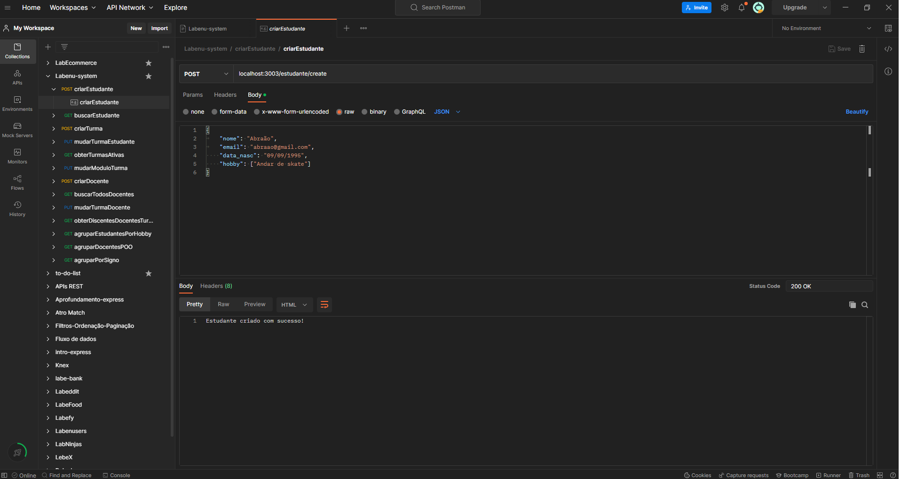
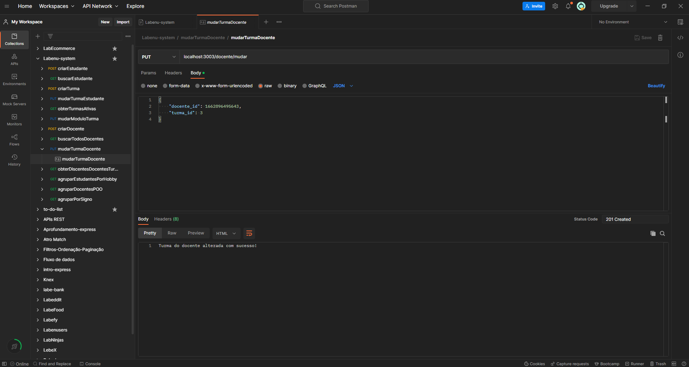
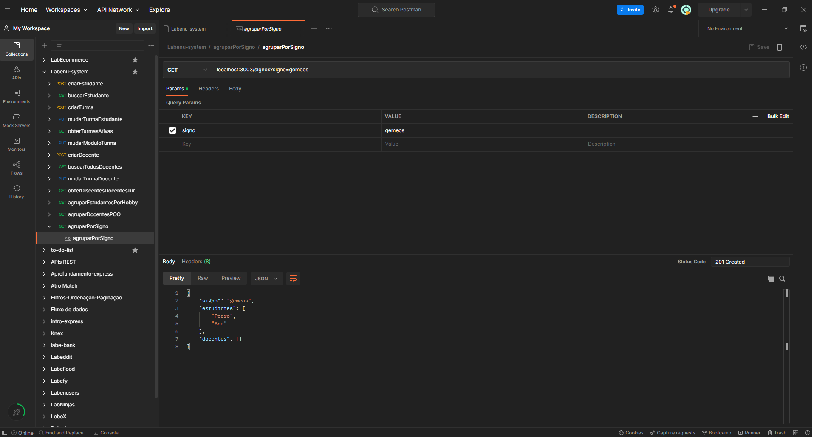

# `Projeto`
Labenu System - backend

# `Link`
[Clique aqui!](https://labenu-system-11.herokuapp.com/)

# `Descrição`
O Projeto Labenu-system-backend foi desenvolvido como uma atividade dentro do curso Full-Stack Web Developer da Labenu, o qual consiste na elaboração de uma API que retorna dados conforme as requisições enviadas. Trata-se de uma ferramenta de cadastro de alunos, professores e turmas. As requisições implementadas são:

- **criarEstudante:** cria um novo estudante.
- **buscarEstudante:** buscar estudante via campo de busca.
- **criarTurma:** cria uma nova turma.
- **mudarTurmaEstudante:** muda a turma de um estudante.
- **obterTurmasAtivas:** retorna todas as turmas que estão ativas (módulo diferente de 0).
- **mudarModuloTurma:** muda o módulo de uma turma.
- **criarDocente:** cria um novo docente.
- **buscarTodosDocentes:** retorna todos os docentes cadastrados.
- **mudarTurmaDocente:** muda a turma de um docente.
- **obterDiscentesDocentesTurma:** retorna todos os docentes e discentes de uma turma.
- **agruparEstudantesPorHobby:** retorna todos os estudantes que possuem um mesmo hobby.
- **agruparDocentesPOO:** retorna todos os docentes que possuem POO como especialidade.
- **agruparPorSigno:** retorna todos os docentes e discentes que possuem um determinado signo.

A documentação da API pode ser acessada [aqui](https://documenter.getpostman.com/view/21552787/2s7YYoB6Nj).

# `Modo de usar`
As requisições que podem ser feitas são:  
- cadastrar novo estudante, fornecendo nome, email, data de nascimento e uma lista de hobbies.
- buscar estudante, fornecendo via query params o campo de busca.
- cadastrar nova turma, fornecendo o nome.
- mudar a turma de um estudante, fornecendo o ID do estudante e o ID da nova turma.
- obter todas as turmas que estão ativas, ou seja, que possuem um módulo com valor entre 1 e 6.
- mudar o módulo de uma turma, forcendo o ID da turma e o módulo desejado (que pode ser um número entre 1 e 6).
- cadastrar um novo docente, fornecendo nome, email, data de nascimento e uma lista de especialidades.
- obter todos os docentes que estão cadastrados.
- mudar a turma de um docente.
- obter todos os alunos e docentes que estão uma mesma turma.
- obter todos os estudantes que possuem um mesmo hobby.
- obter todos os docentes que possuem a especialidade POO.
- obter todos os alunos e docentes que possuem um mesmo signo.

# `Instalando e rodando o projeto via clone`
Fazer o clone do projeto:
- git clone link-do-repositório

Instalar as dependências:
- npm install

Rodar o projeto:
- npm run start

# `Instalando e rodando o projeto via deploy`
Fazer as requisições para os endpoint mostrados na documentação, utilizando, por exemplo:
- Postman
- Insomnia
- Extensão Rest do VSCODE

# `Tecnologias utilizadas`

# `Autores`
Evandro Paulo Folletto  
 

Henrique Rodriguez  
 

Wilson Oliveira  
 

# `Imagens`
Abaixo são mostradas algumas imagens de requisições:

### Requisição criarEstudante:

### Requisição mudarTurmaDocente:

### Requisição agruparPorSigno:
